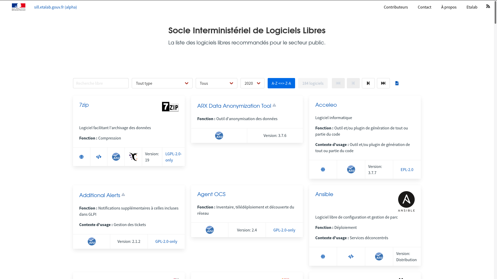

# What is this repository?

This repository contains the source code for the SILL, the catalog of
recommended free software for the public sector.

The list of software itself is maintained [on this repository](https://git.sr.ht/~etalab/sill).

# Develop

    ~$ git clone https://git.sr.ht/~etalab/sill.etalab.gouv.fr
    ~$ cd sill.etalab.gouv.fr/
    ~$ clj -M:test
    ~$ clj -M:run
    ~$ clj -M:fig

Check <http://locahost:9500> then hack and see changes going live.

# Deploy

## Configure environment variables

You will need to configure these environment variables:

    SMTP_HOST: the host from which to send emails
    SMTP_LOGIN: the smtp login to use to send emails
    SMTP_PASSWORD: the smtp password to use to send emails
    SILLWEB_ADMIN_EMAIL: the email where to receive messages
    SILLWEB_FROM: the From header for sent emails
    SILLWEB_PORT: the port to run the application
    SILLWEB_MSGID_DOMAIN: what fqdn to use to build the message-id
    SILLWEB_STATIC_FILES_PATH: where to store static files (no trailing slash)

## Deploy as a jar

    ~$ git clone https://git.sr.ht/~etalab/sill.etalab.gouv.fr
    ~$ cd sillweb/
    ~$ clj -M:js
    ~$ clj -M:uberdeps
    ~$ java -cp target/sillweb.jar clojure.main -m sillweb.server

Then go to <https://localhost:3000> or to your custom base URL.

## Deploy with Docker

Assuming your environments variables are stored in `~/.sillweb_envs`
and you want to expose the 3000 port:

    ~$ git clone https://git.sr.ht/~etalab/sill.etalab.gouv.fr
    ~$ cd sillweb/
    ~$ clj -M:js
    ~$ clj -M:uberdeps
    ~$ docker build -t sillweb .
    ~$ docker run -it -p 3000:3000 --env-file=~/.sillweb_envs sillweb

Then go to <http://localhost:3000>.

# Contributing

The development of this repository happens on [the SourceHut
repository](https://git.sr.ht/~etalab/sill.etalab.gouv.fr).  

The code is also published on [GitHub](https://github.com/etalab/sill.etalab.gouv.fr) to reach more developers, but
please do not send pull requests there.

You can send **patches** by email using [git-send-email.io](https://git-send-email.io/).  For your
patches to be processed correctly, configure your local copy with
this:

    git config format.subjectPrefix 'PATCH sill.etalab.gouv.fr'

You can also contribute with bug reports, feature requests or general
questions by writing to [~etalab/codegouvfr-devel@lists.sr.ht](mailto:~etalab/codegouvfr-devel@lists.sr.ht).

# Support the Clojure(script) ecosystem

If you like Clojure(script), please consider supporting maintainers by
donating to [clojuriststogether.org](https://www.clojuriststogether.org).

# License

2019-2021 DINUM, Bastien Guerry.

This application is published under the [EPL 2.0 license](LICENSE).

